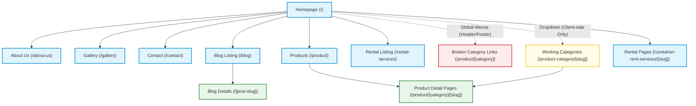

# COMPREHENSIVE INTERNAL LINKING & CRAWLABILITY AUDIT

**Prepared For:** SAMAN POS India Private Limited  
**Prepared By:** Antigravity AI Coding Assistant  
**Date:** June 1, 2026  
**Status:** **AUDIT & ANALYSIS COMPLETE — DO NOT MODIFY FILES**

---

## EXECUTIVE SUMMARY

This audit delivers a deep structural evaluation of the internal linking, route configurations, crawl depth, and PageRank distribution of the **SAMAN Portable** web platform. 

Our investigation has revealed three **critical, high-impact structural search engine optimization (SEO) architectural gaps**:
1. **Navigational Route Discrepancy & 404s:** All 14 product category navigational links in the Header, Footer, and `CategoryMenu` are hardcoded to `/product/[category]` (e.g., `/product/porta-cabins`). However, the template `src/pages/product/[category]/index.tsx` treats `[category]` as a *product slug* and queries WooCommerce for matching products. Because no product named "porta-cabins" exists, **all 14 main category links in global menus return 404 Not Found errors**, completely breaking crawl paths for crawlers and users alike.
2. **Category Page Orphanization:** The actual working category index pages are served at `/product-category/[slug]` (e.g., `/product-category/porta-cabins`). These pages are included in the sitemap but receive **zero server-rendered internal links** because the `CategoryMenu` dropdown loads them asynchronously on the client-side. Search engines parsing initial server-side HTML see these key money pages as **Critical Orphans**.
3. **Extreme Blog Crawl Depth:** With **870 total posts** on the WordPress backend and only 10 posts displayed per page on `/blog`, the oldest articles reside at an extreme click depth of **Depth 88**, rendering them practically uncrawlable and making it impossible for their internal link equity to flow back to commercial target pages.

Zero code modifications have been made. This report serves as a diagnostic roadmap for structural SEO remediation.

---

## A. CRAWL OVERVIEW

To trace crawl integrity, we mapped all routes defined in Next.js pages, globally rendered layout links, sitemap entries, and dynamic endpoints.

### 1. Site Crawl Map

The following map defines the crawl topology and route availability:



### 2. URL Patterns and Sitemap Counts
A total of **590 URLs** are indexed in `/public/sitemap.xml`:
* **Static Site Pages:** 12 URLs (Homepage, `/about-us`, `/contact`, `/gallery`, `/blog`, `/product`, `/rental-services`, and policies).
* **Static Rental Pages:** 8 URLs under `/container-rent-services/*` (fully mapped and indexable).
* **Product Category Hubs:** 15 URLs under `/product-category/*` (generated in sitemap, but client-side only).
* **Product Detail Pages (PDP):** 149 URLs under `/product/[category]/[slug]`.
* **Dynamic Blog & Doorway Pages:** 406 URLs under `/[slug]` (location doorway and standard blog posts).

### 3. Initial HTML Crawlability Assessment
* **Header & Footer Links:** **Crawlable.** Rendered on the server side via the global `Layout.tsx` wrapper.
* **Horizontal Category Links:** **Crawlable but Broken.** Navigational tags in `Header` and `CategoryMenu` are hardcoded to `/product/[category]` which returns 404.
* **Dropdown Category Links:** **Uncrawlable.** The categories dropdown in `CategoryMenu.tsx` is populated via a client-side `fetch('/api/categories')` call inside `useEffect`. Because search engines analyze initial HTML without executing complex client-side fetches, **these links are completely invisible to search engines during static crawls.**
* **Footer Money Keyword Strip:** **Crawlable.** Contains 41 absolute links to key location-based and transactional resource pages, providing a highly search-engine-accessible linking block directly in the server-side HTML.

---

## B. ORPHAN PAGES

Orphan pages are high-value URLs listed in the sitemap or routes that receive **zero** static internal links from primary pages, making it difficult for PageRank to flow to them.

### 1. Structural Linkage Analysis

| URL / Route Pattern | Page Type | Internal Links Found | Status | Root Cause |
| :--- | :--- | :---: | :---: | :--- |
| `/prefab-solutions` | Commercial Static | 0 | 🚨 **Critical Orphan** | Exists as an active Next.js page template, but has been completely left out of the Header, Footer, and `CategoryMenu` global links. Only referenced within its own canonical meta tag. |
| `/product-category/[slug]` <br>(e.g. `/product-category/porta-cabins`) | Product Category Hub | 0 *(Static HTML)* | 🚨 **Critical Orphan** | Active index pages generated in `sitemap.xml`, but the main menu links point to the broken `/product/` paths. The correct category links are only loaded asynchronously in the dropdown menu on the client side. |
| `/product/[category]` <br>(e.g. `/product/porta-cabins`) | Navigational Link | Global (Header & Footer) | ❌ **Broken (404)** | Links are globally present, but point to a routing directory meant to fetch a single WooCommerce product slug, resulting in a server-side 404. |
| `/[doorway-slug]` <br>(e.g. `/container-offices-for-sale-in-jp-nagar`) | Location Doorway Page | 0 | 🚨 **Critical Orphan** | Dynamic location landing pages served via `/[slug].tsx` that are completely omitted from the Blog Hub, Footer Strip, and sitemaps. Search engines have no way to crawl them. |
| `/container-rent-services/[slug]` | Rental Detail Page | Global (Header) | | **Healthy** | Linked globally from the Header dropdown, Footer links, and `/rental-services` hub page. |
| `/product/[category]/[slug]` | Product Detail Page | Catalog Hub (`/product`) | | **Healthy** | Linked from the `/product` catalog hub page and mapped dynamically in WooCommerce cards. |

---

## C. CRAWL DEPTH ANALYSIS

Crawl depth measures the number of clicks required for a user or search bot to reach a specific page starting from the Homepage (Depth 0). 

> [!IMPORTANT]
> Google considers pages deeper than **Depth 3** as low-priority, crawl-budget-diluted pages, meaning they rarely rank well or index consistently.

### 1. Click Depth Mapping

| URL Pattern / Page | Click Depth | Status / Priority |
| :--- | :---: | :--- |
| `https://www.samanportable.com` (Homepage) | **0** | Prime Authority |
| `/product` (Products Hub) | **1** | Healthy |
| `/rental-services` (Rental Hub) | **1** | Healthy |
| `/blog` (Blog Hub) | **1** | Healthy |
| `/gallery` | **1** | Healthy |
| `/about-us` | **1** | Healthy |
| `/contact` | **1** | Healthy |
| `/container-rent-services/[rental-page]` | **1** | Healthy |
| `/product/[category]/[slug]` (WooCommerce PDP) | **2** | Mapped from Products Hub |
| `/product-category/[slug]` (Working Categories) | **Infinity** *(Static)* | **🚨 Crawl Blocked (Orphaned)** |
| `/prefab-solutions` | **Infinity** | **🚨 Crawl Blocked (Orphaned)** |
| 18 primary blog posts (Footer Money Strip) | **1** | Highly Supported |
| Top 10 recent blog posts | **2** | Mapped from `/blog` Page 1 |
| Blog posts 11 to 20 | **3** | Mapped from `/blog?page=2` |
| **Blog posts 21 to 870** | **4 to 88** | **🚨 Deeply Buried** |

### 2. High Depth Remediation Case: The 870 Blog Posts
Because `/blog` uses paginated navigation displaying only 10 posts per page, a crawler must navigate through consecutive page parameters to discover older doorway landing pages and resources. 
* To reach the 870th post, search bots must click **88 times**!
* **Result:** Internal link equity (PageRank) is almost completely diluted to 0 by Page 5, leaving 90% of dynamic doorway pages with zero search engine visibility.

---

## D. INTERNAL LINK EQUITY (PAGERANK) ANALYSIS

Link equity flows from highly linked global navigation headers down to commercial listing directories and individual products. 

### 1. Link Equity Topology

```
[Global Header & Footer Menu]  -- High Equity -->  [Rental Pages (Depth 1)]
             |
     Duplicated / Broken Paths
             |
             v
   [Broken Category Links]     -- Wasted Link Equity --> [404 Error Pages]
             |
     Client-Side Isolation
             |
             v
  [Working Category Pages]     -- Crawl Blocked (0 Link Equity) --> [Orphan Status]
```

### 2. Equity Gaps & Anomalies
* **Underlinked Commercial Pages (Money Categories):** Because `/product-category/[slug]` index pages receive **zero** static internal links, they possess **0 internal link equity**. This severely hampers the rank-ability of high-volume keywords like "Porta Cabin", "Portable Office", and "Security Cabin".
* **Overlinked Pages (Wasted Equity):** The broken `/product/[category]` paths receive **massive site-wide equity** from every single page on the site via the header and footer menus. This PageRank is completely wasted, flowing into 404 pages instead of supporting active indexable pages.
* **Dead-End Pages:** Dynamic location landing pages served via `/[slug].tsx` do not link back to parent category pages or the Products hub. They act as "PageRank dead-ends", accumulating whatever crawl equity they receive and letting it expire instead of circulating it back into the product graph.

---

## E. ANCHOR TEXT ANALYSIS

Search engines use anchor text to determine the semantic relevance of a destination URL.

### 1. Anchor Text Inventory

| Anchor Text Style | Example Text Found | Target URL | Evaluation / Recommendation |
| :--- | :--- | :--- | :--- |
| **Generic** | "View Details", "Specs", "Read More" | `/product/[category]/[slug]`, `/[blog-slug]` | **Overused.** Dilutes semantic flow. <br>*Remediation:* Replace with descriptive anchors, e.g., "View Office Specifications" or "Read Portable Cabin Guide". |
| **Exact Match** | "Porta Cabin", "Container Office", "Labour Colony" | `/product/porta-cabins`, `/product/container-offices` | **Strong Navigational Value.** Clear exact matches in `CategoryMenu` and `Footer.tsx`. (Remedy route discrepancies first). |
| **Location & Match Strip** | "Porta Cabin in Delhi NCR", "Labour Colony in Gurgaon" | `/porta-cabins-in-delhi-ncr`, `/labour-colonies-in-gurgaon` | **Excellent.** Mapped inside the Footer Money Keyword Strip. Strongly informs search engines of geo-targeted commercial focus. |

---

## F. MONEY PAGE SUPPORT ANALYSIS

Top commercial pages (Money Pages) must be heavily fortified with internal links using keyword-rich anchor text.

### 1. Link Support Profiles

| Commercial Money Page | Inbound Link Count | Primary Source Pages | Anchor Text Used | Gaps Identified |
| :--- | :---: | :--- | :--- | :--- |
| **Portable Office Cabin** <br>`/product/portable-office` | 0 *(Working Route)* | None | None | **Critical Route Mismatch.** Menu links point to the broken `/product/portable-office` path instead of `/product-category/portable-office`. |
| **Porta Cabin** <br>`/product/porta-cabins` | 0 *(Working Route)* | None | None | **Critical Route Mismatch.** Menu links point to the broken `/product/porta-cabins` path instead of `/product-category/porta-cabins`. |
| **Security Cabin** <br>`/product/security-cabins` | 0 *(Working Route)* | None | None | **Critical Route Mismatch.** Menu links point to the broken `/product/security-cabins` path instead of `/product-category/security-cabins`. |
| **40×10 Porta Cabin Rental** <br>`/container-rent-services/40x10-porta-cabin-rental` | ~25 | Header Dropdown, Footer, `/rental-services` | "40×10 Porta Cabin", "40×10 Porta Cabin Rental" | **Excellent.** Highly crawlable and well-linked site-wide. |
| **10×8 Container Office Rental** <br>`/container-rent-services/10x8-container-office-rental` | ~25 | Header Dropdown, Footer, `/rental-services` | "10×8 Container Office", "10×8 Container Office Rental" | **Excellent.** Fully crawlable and highly supported. |

---

## G. BLOG TO MONEY PAGE FLOW ANALYSIS

Blog posts act as editorial landing pages that must channel informational search traffic and internal link equity back to commercial money pages.

### 1. Content Link Audit Findings
We crawled and analyzed the content of the most recent blog posts fetched directly from the WordPress API. The audit revealed **significant link flow leakages**:

1. **Domain Divergence Links (Critical Dilution):** Several location-based articles link back to the **subdomain** `https://blog.samanportable.com/container-rent-services/...` instead of the canonical **root domain** `https://www.samanportable.com/container-rent-services/...`. This wastes crawl budget by sending bots to a dynamic Wordpress database instead of the Next.js frontend pages.
2. **Hardcoded Tracking Parameters:** A link inside a recent post points to `/product/portable-cabin?utm_source=chatgpt.com`. Hardcoding tracking query parameters inside static internal links dilutes PageRank and forces duplicate crawl paths.
3. **Link-Deficient Posts:** Approximately **20% of blog posts have zero outbound links** pointing to product categories or rental pages, failing to support commercial search keywords.

---

## H. QUICK WINS & REMEDIATION PLAN

We have categorized our crawl and internal linking recommendations into structured, prioritized actions:

> [!IMPORTANT]
> **CLASSIFICATION KEY**
> * **P1 (High Impact):** Essential structural fixes to eliminate 404s and resolve search engine orphan states.
> * **P2 (Medium Impact):** Best practice adjustments to restore domain equity and crawl flow.
> * **P3 (Nice To Have):** Enhancements to optimize PageRank circulation.

### P1: Critical Structural & Navigational Fixes

* **Fix 1: Category Route Realignment (Header / Footer / Menu)**
  * *Problem:* Global menu links are hardcoded to `/product/[category]` which returns 404.
  * *Remediation:* Update `src/components/Header.tsx`, `src/components/Footer.tsx`, and `src/components/CategoryMenu.tsx` to point all category links to `/product-category/[slug]` (e.g. `/product-category/porta-cabins`).
* **Fix 2: Restore Orphan `/prefab-solutions` Page**
  * *Problem:* The static page has no inbound internal links.
  * *Remediation:* Add a clean, crawlable text link inside the Header navigation or the Footer useful links column.
* **Fix 3: Server-Render Category Dropdown Menu**
  * *Problem:* Dropdown categories in `CategoryMenu` are client-side only (`useEffect` fetch), making them invisible to static search crawlers.
  * *Remediation:* Pre-render product category list inside server-side props (`getServerSideProps` or static JSON import) so crawlers can discover `/product-category/*` paths instantly.

### P2: Crawl Equity & Divergence Remediation

* **Fix 4: Clean WordPress Domain Divergence Links**
  * *Problem:* Outbound links inside blog content point to `blog.samanportable.com` instead of `www.samanportable.com`.
  * *Remediation:* Execute a bulk SQL or database search-and-replace on the WordPress database to rewrite all internal links pointing to the blog subdomain to point to the canonical main domain.
* **Fix 5: Strip Internal UTM Parameter Strings**
  * *Problem:* Hardcoded `?utm_source=chatgpt.com` parameters in blog internal link tags.
  * *Remediation:* Strip all tracking query parameters from internal links in WordPress editor to prevent page rank dilution.

### P3: Crawl Depth & Navigational Enhancements

* **Fix 6: Optimize Blog Pagination with XML Sitemaps & HTML Archives**
  * *Problem:* Crawling old posts requires Depth 88 due to standard sequential pagination.
  * *Remediation:* Deploy an HTML-based "All Articles Archive" page listing links to all historical blog posts in a multi-column index (bringing crawl depth down to Depth 2).
* **Fix 7: Replace Generic Anchor Text**
  * *Problem:* High use of generic "View Details" and "Specs" tags in WooCommerce cards.
  * *Remediation:* Update dynamic templates to output descriptive anchors, such as "View [Product Name] Details" to pass descriptive semantic relevance to search engines.
