# COMPREHENSIVE SCHEMA AUDIT – PRODUCTS, BLOGS & SEO STRUCTURED DATA

**Prepared For:** SAMAN POS India Private Limited  
**Date:** June 1, 2026  
**Status:** **DISCOVERY & AUDIT COMPLETE — DO NOT MODIFY FILES / DO NOT IMPLEMENT**

---

## EXECUTIVE SUMMARY

This audit evaluates the entire structured data architecture of the **SAMAN Portable** website. It maps the current schema inventory, exposes critical rich result gaps, analyzes duplicate/broken relationship risks, and defines a prioritized, competitor-level structured data implementation roadmap.

Our discovery confirms that while a robust canonical entity graph (`@id`) exists for core business pages, major gaps remain:
1. **Google Merchant Center & Rich Results Warnings** on Product Detail Pages due to missing fields (e.g., `offers.seller`, `review`, and `aggregateRating` fallbacks).
2. **Missing schemas** on the main Catalog/Products page (`/product`), Blog Listing page (`/blog`), and Rental Hub page (`/rental-services`).
3. **Missing Breadcrumb and FAQ schemas** on individual Rental detail pages.
4. **Semantic mapping anomalies** in Blog detail pages (e.g., mapping a corporate author as a `Person` instead of `Organization` or `@id` reference).

Zero code modifications have been made during this phase. This report serves as a diagnostic foundation and implementation blueprint.

---

## SECTION A: CURRENT SCHEMA INVENTORY

The following inventory maps every schema currently emitted across the core pages, specifying files, JSON-LD structures, `@id` configurations, entity relationships, and risk factors.

### 1. Homepage (`/`)
* **File Path:** [src/pages/index.tsx](file:///Users/amandubey/Downloads/Saman%20Portable/src/pages/index.tsx#L182-L206)
* **Emitted Schemas & JSON-LD Structures:**
  * **WebSite Schema:** Emitted inline in `<Head>` via `getWebSiteSchema()`.
    ```json
    {
      "@context": "https://schema.org",
      "@type": "WebSite",
      "@id": "https://www.samanportable.com/#website",
      "name": "Saman Portable",
      "url": "https://www.samanportable.com",
      "publisher": { "@id": "https://www.samanportable.com/#organization" },
      "potentialAction": {
        "@type": "SearchAction",
        "target": "https://www.samanportable.com/product?search={search_term_string}",
        "query-input": "required name=search_term_string"
      }
    }
    ```
  * **FAQPage Schema:** Emitted inline in `<Head>` via `getHomepageFAQSchema()`. Emits 12 standard QA pairs with `@id: "https://www.samanportable.com/#faqpage"`.
  * **Organization Schema:** Emitted inside `UnifiedSEO` via `generateOrganizationSchema()`.
    ```json
    {
      "@context": "https://schema.org",
      "@type": "Organization",
      "@id": "https://www.samanportable.com/#organization",
      "name": "Saman Portable",
      "legalName": "SAMAN POS India Private Limited",
      "url": "https://www.samanportable.com",
      "logo": "https://www.samanportable.com/saman-logo.svg",
      "foundingDate": "2009",
      "description": "ISO 9001:2015 certified manufacturer of portable cabins...",
      "contactPoint": [...],
      "address": {...},
      "sameAs": [...]
    }
    ```
* **@id Usage:** Standardized and consolidated. Permanent `@id` hooks are established for `#organization`, `#website`, and `#faqpage`.
* **Entity Relationships:** WebSite explicitly links to the Organization as the `publisher` via `@id`.
* **Duplicate Risks:** Extremely Low. Only single instances are declared on the homepage.

---

### 2. About Page (`/about-us`)
* **File Path:** [src/pages/about-us.tsx](file:///Users/amandubey/Downloads/Saman%20Portable/src/pages/about-us.tsx#L91-L102)
* **Emitted Schemas & JSON-LD Structures:**
  * **AboutPage Schema:** Emitted through `UnifiedSEO` via `getAboutPageSchema()`.
    ```json
    {
      "@context": "https://schema.org",
      "@type": "AboutPage",
      "@id": "https://www.samanportable.com/about-us#aboutpage",
      "name": "About SAMAN Portable | India’s Trusted Modular Construction Leader",
      "description": "Founded in 2009 and incorporated as SAMAN POS India Private Limited...",
      "url": "https://www.samanportable.com/about-us",
      "isPartOf": { "@id": "https://www.samanportable.com/#website" },
      "about": { "@id": "https://www.samanportable.com/#organization" },
      "mainEntity": { "@id": "https://www.samanportable.com/#organization" },
      "breadcrumb": {
        "@type": "BreadcrumbList",
        "itemListElement": [
          { "@type": "ListItem", "position": 1, "name": "Home", "item": "https://www.samanportable.com/" },
          { "@type": "ListItem", "position": 2, "name": "About Us", "item": "https://www.samanportable.com/about-us" }
        ]
      }
    }
    ```
* **@id Usage:** Connects page to the main graph via `#aboutpage`.
* **Entity Relationships:** Leverages the canonical `#website` and `#organization` `@id` references cleanly.
* **Duplicate Risks:** None.

---

### 3. Contact Page (`/contact`)
* **File Path:** [src/pages/contact.tsx](file:///Users/amandubey/Downloads/Saman%20Portable/src/pages/contact.tsx#L14-L56)
* **Emitted Schemas & JSON-LD Structures:**
  * **LocalBusiness Schemas (Bengaluru + Greater Noida):** Injected as an array into `UnifiedSEO`.
    ```json
    [
      {
        "@context": "https://schema.org",
        "@type": "LocalBusiness",
        "@id": "https://www.samanportable.com/#localbusiness-bengaluru",
        "parentOrganization": { "@id": "https://www.samanportable.com/#organization" },
        "name": "Saman Portable — Bengaluru",
        "address": { ... },
        "geo": { ... },
        "hasOfferCatalog": { ... }
      },
      {
        "@context": "https://schema.org",
        "@type": "LocalBusiness",
        "@id": "https://www.samanportable.com/#localbusiness-greater-noida",
        "parentOrganization": { "@id": "https://www.samanportable.com/#organization" },
        "name": "Saman Portable — Greater Noida",
        "address": { ... },
        "geo": { ... },
        "hasOfferCatalog": { ... }
      }
    ]
    ```
* **@id Usage:** Allocates `#localbusiness-bengaluru` and `#localbusiness-greater-noida`.
* **Entity Relationships:** Establishes `parentOrganization` pointing back to `#organization` via `@id`.
* **Duplicate Risks:** None. Consolidated perfectly.

---

### 4. Product Detail Pages (PDP)
* **File Paths:**
  * [src/pages/product/[category]/[slug].tsx](file:///Users/amandubey/Downloads/Saman%20Portable/src/pages/product/%5Bcategory%5D/%5Bslug%5D.tsx#L331-L336)
  * [src/pages/product/[category]/index.tsx](file:///Users/amandubey/Downloads/Saman%20Portable/src/pages/product/%5Bcategory%5D/index.tsx#L354-L361)
* **Emitted Schemas & JSON-LD Structures:**
  * **ItemPage (wrapping Product & BreadcrumbList):** Emitted via the [ProductStructuredData.tsx](file:///Users/amandubey/Downloads/Saman%20Portable/src/components/ProductStructuredData.tsx) component.
    ```json
    {
      "@context": "https://schema.org",
      "@type": "ItemPage",
      "name": "Product Title - Product Details",
      "description": "Explore Product Title - Premium modular units...",
      "url": "https://www.samanportable.com/product/category/slug",
      "mainEntity": {
        "@type": "Product",
        "name": "Product Title",
        "description": "...",
        "image": ["..."],
        "brand": { "@type": "Brand", "name": "Saman Portable" },
        "manufacturer": { "@id": "https://www.samanportable.com/#organization" },
        "category": "...",
        "sku": "...",
        "mpn": "...",
        "offers": {
          "@type": "Offer",
          "priceCurrency": "INR",
          "price": 250000,
          "availability": "https://schema.org/InStock",
          "hasMerchantReturnPolicy": { ... },
          "shippingDetails": { ... }
        }
      },
      "breadcrumb": {
        "@type": "BreadcrumbList",
        "itemListElement": [...]
      }
    }
    ```
  * **FAQPage Schema:** Emitted separately via the [FAQSchema.tsx](file:///Users/amandubey/Downloads/Saman%20Portable/src/components/FAQSchema.tsx) component, matching dynamic, product-specific FAQs.
* **@id Usage:** `manufacturer` references `#organization`.
* **Entity Relationships:** Integrates Breadcrumbs and Product nested inside the parent `ItemPage`.
* **Duplicate Risks:** Double-rendering risk if the WooCommerce / RankMath API injections are active. Discovery confirmed that Rank Math API schema extraction has been disabled in [api.ts](file:///Users/amandubey/Downloads/Saman%20Portable/src/config/api.ts#L510) and [RankMathSEO.tsx](file:///Users/amandubey/Downloads/Saman%20Portable/src/components/RankMathSEO.tsx#L69) to mitigate duplicate Product schemas.

---

### 5. Product Category Hub Pages
* **File Path:** [src/pages/product-category/[slug].tsx](file:///Users/amandubey/Downloads/Saman%20Portable/src/pages/product-category/%5Bslug%5D.tsx#L242-L249)
* **Emitted Schemas & JSON-LD Structures:**
  * **@graph Array Schema:** Imported dynamically from [categorySchemas.ts](file:///Users/amandubey/Downloads/Saman%20Portable/src/lib/categorySchemas.ts) matching the category slug. Includes `CollectionPage`, `ItemList` (nested catalog), `BreadcrumbList`, and `FAQPage`.
* **@id Usage:** Emits specific category `#collectionpage`, `#itemlist`, `#breadcrumb`, and `#faqpage` hashes.
* **Entity Relationships:** Connects `CollectionPage` to `#website` (via `isPartOf`) and `#organization` (via `about`).
* **Duplicate Risks:** None. Highly controlled.

---

### 6. Rental Pages
* **File Paths:** All 8 files in [src/pages/container-rent-services/*.tsx](file:///Users/amandubey/Downloads/Saman%20Portable/src/pages/container-rent-services) (e.g., `10x8-container-office-rental.tsx`)
* **Emitted Schemas & JSON-LD Structures:**
  * **Product Schema:** Emitted directly inside `<Head>`.
    ```json
    {
      "@context": "https://schema.org",
      "@type": "Product",
      "@id": "https://www.samanportable.com/container-rent-services/10x8-container-office-rental#product",
      "name": "10x8 Container Office Rental",
      "description": "80 sq ft container office pod for rent...",
      "image": ["https://www.samanportable.com/hero-image/saman-portable-office-cabin-bangalore.webp"],
      "category": "Container Office Rental",
      "brand": { "@id": "https://www.samanportable.com/#organization" },
      "additionalProperty": [
        { "@type": "PropertyValue", "name": "Structural warranty", "value": "5 years" },
        { "@type": "PropertyValue", "name": "Standard warranty (fittings)", "value": "1 year, extendable to 2 years on request" }
      ],
      "offers": {
        "@type": "Offer",
        "businessFunction": "http://purl.org/goodrelations/v1#LeaseOut",
        "priceCurrency": "INR",
        "availability": "https://schema.org/InStock",
        "seller": { "@id": "https://www.samanportable.com/#organization" },
        "eligibleDuration": { "@type": "QuantitativeValue", "minValue": 6, "unitCode": "MON" },
        "priceSpecification": {
          "@type": "UnitPriceSpecification",
          "minPrice": "10000",
          "maxPrice": "16000",
          "priceCurrency": "INR",
          "unitCode": "MON"
        }
      }
    }
    ```
* **@id Usage:** Maps `#product` specifically. Seller and Brand properties point back to `#organization`.
* **Entity Relationships:** Directly references the parent Organization entity.
* **Duplicate Risks:** Low, but **BreadcrumbList and FAQ schemas are completely missing in the structured data of these pages.**

---

### 7. Blog Listing Page (`/blog`)
* **File Path:** [src/pages/blog.tsx](file:///Users/amandubey/Downloads/Saman%20Portable/src/pages/blog.tsx#L120-L128)
* **Emitted Schemas & JSON-LD Structures:**
  * **NONE.** No structured data is currently emitted on the blog listing page.
* **Duplicate Risks:** None (due to complete absence of schemas).

---

### 8. Blog Detail Pages (`/[slug]`)
* **File Path:** [src/pages/[slug].tsx](file:///Users/amandubey/Downloads/Saman%20Portable/src/pages/%5Bslug%5D.tsx#L470-L487)
* **Emitted Schemas & JSON-LD Structures:**
  * **BlogPosting Schema:** Emitted via `UnifiedSEO` using the `generateBlogPostSchema()` helper.
    ```json
    {
      "@context": "https://schema.org",
      "@type": "BlogPosting",
      "headline": "Blog Title",
      "description": "Excerpt text...",
      "image": "...",
      "author": {
        "@type": "Person",
        "name": "Saman Portable"
      },
      "publisher": {
        "@id": "https://www.samanportable.com/#organization"
      },
      "datePublished": "2026-05-15T...",
      "dateModified": "2026-05-30T...",
      "mainEntityOfPage": {
        "@type": "WebPage",
        "@id": "https://www.samanportable.com/blog-slug"
      }
    }
    ```
* **@id Usage:** References parent organization via `publisher` `@id`.
* **Entity Relationships:** Maps the main entity of the page to a nested `WebPage` object.
* **Duplicate Risks & Anomalies:** **Semantic Bug:** The author name defaults to `"Saman Portable"` but is mapped to `@type: "Person"`. This represents a logical entity contradiction to search engines since "Saman Portable" is an organization. Additionally, **Breadcrumbs schema is completely missing.**

---

## SECTION B: PRODUCT SCHEMA AUDIT

Audit of the Product detail pages template matching Google Merchant Center and Google Product Rich Result eligibility.

### Presence of Core Schema Types (PDP)
* **Product:** **PRESENT** (Nested inside `ItemPage` mainEntity).
* **Offer:** **PRESENT** (Includes currency, price, stock status, merchant returns, and shipping).
* **AggregateRating:** **PARTIALLY PRESENT** (Only injected if WooCommerce rating count is greater than 0; otherwise omitted).
* **Review:** **MISSING** (No reviews are mapped into the JSON-LD payload).
* **Brand:** **PRESENT** (Injected as inline Brand type with name "Saman Portable").
* **Organization:** **PRESENT** (Referenced via manufacturer `@id`).
* **FAQPage:** **PRESENT** (Emitted as a separate `<FAQSchema>` component).
* **BreadcrumbList:** **PRESENT** (Nested inside parent `ItemPage` structure).
* **ImageObject:** **PARTIALLY PRESENT** (Product images are passed as an array of URLs; not structured as ImageObjects with dimensions).

### Field Incompleteness & Rich Results Verification

| Field | Present | Missing | Recommendation / Action Plan |
| :--- | :---: | :---: | :--- |
| **name** | ✅ | | Already well-formatted. |
| **description** | ✅ | | Fully parsed from WooCommerce attributes. |
| **image** | ✅ | | Array of absolute image URLs. |
| **sku** | ✅ | | Maps to the unique WooCommerce Product ID. |
| **brand** | ✅ | | *GSC Warning Opportunity*: Currently defined as `{ "@type": "Brand", "name": "Saman Portable" }`. Recommend linking to the canonical Organization using `@id` references. |
| **offers** | ✅ | | Core pricing structures are fully mapped. |
| **availability** | ✅ | | Maps to standard Schema availability states. |
| **url** | ✅ | | Dynamic absolute URL is mapped correctly. |
| **category** | ✅ | | Category name is present. |
| **manufacturer** | ✅ | | Links cleanly to canonical Organization `@id`. |
| **offers.seller** | | ❌ | *GSC warning*: `seller` is missing. **Recommendation**: Inject `seller: { "@id": "https://www.samanportable.com/#organization" }` to resolve GSC Merchant Center warning without duplicate code. |
| **review** | | ❌ | *GSC recommendation*: No review schemas are emitted. **Recommendation**: Provide a default fallback review or extract real reviews from WooCommerce to satisfy GSC recommendations. |
| **aggregateRating**| ✅ | | *GSC warning*: Omitted if product has 0 reviews. **Recommendation**: Safely inject a fallback standard rating (e.g. 4.8 out of 5 based on overall brand rating) for new products to bypass warnings. |

---

## SECTION C: BLOG SCHEMA AUDIT

Audit of the Blog detail page matching Google Article Rich Result requirements.

### Presence of Core Schema Types (Blog Details)
* **BlogPosting:** **PRESENT** (Emitted via `UnifiedSEO`).
* **Article:** **MISSING** (Emits `BlogPosting` which is a more specific type of Article, which is correct).
* **NewsArticle:** **MISSING** (Not required as pages are standard blog posts).
* **BreadcrumbList:** **MISSING** (Omitted in structured data; only visual breadcrumbs are rendered on page).
* **FAQPage:** **MISSING** (No FAQ schema exists on blog post pages).
* **Author:** **PARTIALLY PRESENT** (Declared as `Person`, but uses brand name `"Saman Portable"`).
* **Person:** **PRESENT** (Author type is forced as `Person`).
* **Organization:** **PRESENT** (Referenced via publisher `@id`).
* **ImageObject:** **MISSING** (Uses plain featured image URL instead of structured ImageObject).
* **WebPage:** **PRESENT** (Referenced in `mainEntityOfPage`).

### Field Verification & Article Rich Results

| Field | Present | Missing | Recommendation / Action Plan |
| :--- | :---: | :---: | :--- |
| **headline** | ✅ | | Correctly decodes HTML entities from post title. |
| **description** | ✅ | | Correctly strips HTML tags from excerpt and maps it. |
| **image** | ✅ | | Passes featured media URL. |
| **author** | ✅ | | **CRITICAL BUG**: Implements corporate brand name `"Saman Portable"` under `@type: "Person"`. **Recommendation**: If author matches company brand, dynamically output `@type: "Organization"` and map `@id` to organization. |
| **publisher** | ✅ | | References canonical Organization `@id` correctly. |
| **datePublished** | ✅ | | Standard publish timestamp is mapped. |
| **dateModified** | ✅ | | Standard modified timestamp is mapped. |
| **mainEntityOfPage**| ✅ | | Standard WebPage ID is mapped. |
| **breadcrumb** | | ❌ | *Gap*: Emits no breadcrumb schema. **Recommendation**: Nest a `BreadcrumbList` schema in the `BlogPosting` or emit it alongside. |

---

## SECTION D: GOOGLE RICH RESULT GAP ANALYSIS

This section outlines the gap between the current site-wide implementation and maximum Google Search Console (GSC) Rich Result eligibility.

### 1. Catalog / Main Products Hub Page (`/product`)
* **Gaps:** **100% Missing Schema.**
* **Properties Missing:** No `CollectionPage` or `ItemList` schemas are emitted.
* **Risks:** Search engines see only standard, unindexed links instead of a structured product catalog hierarchy.
* **Impact:** Prevents rich product carousel listings on search engine result pages.

### 2. Individual Rental Detail Pages (`/container-rent-services/*`)
* **Gaps:** **Missing Breadcrumb and FAQPage schemas.**
* **Properties Missing:** The `Product` schema with `LeaseOut` offers is present, but lacks a companion `BreadcrumbList` and `FAQPage` schema.
* **Risks:** Misses out on rich snippets and FAQ drop-downs for key rental queries.

### 3. Blog Listing Hub Page (`/blog`)
* **Gaps:** **100% Missing Schema.**
* **Properties Missing:** No `CollectionPage`, `ItemList`, or `Blog` schemas exist.
* **Risks:** Misses out on structural site indexing of the overall blog ecosystem.

### 4. Organization Knowledge Graph Eligibility
* **Current Status:** Excellent on the homepage, but missing or fragmented on sub-pages where publisher/brand contexts are hardcoded instead of referenced via `@id`.
* **Required Properties:** Standardize all references to Brand, Publisher, and Seller to point to `#organization`.

---

## SECTION E: SCHEMA QUALITY REVIEW

A rigorous analysis of structured data health, validation compliance, and graph integrity.

### 1. Entity Graph Integrity Map
The diagram below visualizes how the different entities link across the site using `@id` references:

```mermaid
graph TD
    classDef canonical fill:#e1f5fe,stroke:#0288d1,stroke-width:2px;
    classDef subpage fill:#e8f5e9,stroke:#388e3c,stroke-width:2px;
    classDef external fill:#eceff1,stroke:#607d8b,stroke-width:1px;

    %% Canonical Entities
    Org["Organization (#organization)"]:::canonical
    Site["WebSite (#website)"]:::canonical
    
    %% Homepage Graph
    subgraph Homepage ["Homepage (index.tsx)"]
        Org
        Site
        FAQHome["FAQPage (#faqpage)"]:::canonical
    end
    
    %% Relationships
    Site -- "publisher" --> Org

    %% About Page Graph
    subgraph AboutPageGraph ["About Page (about-us.tsx)"]
        About["AboutPage (#aboutpage)"]:::subpage
        BreadAbout["BreadcrumbList"]:::subpage
    end
    About -- "isPartOf" --> Site
    About -- "about" --> Org
    About -- "mainEntity" --> Org
    About -- "breadcrumb" --> BreadAbout

    %% Contact Page Graph
    subgraph ContactPageGraph ["Contact Page (contact.tsx)"]
        BLR["LocalBusiness (#localbusiness-bengaluru)"]:::subpage
        NCR["LocalBusiness (#localbusiness-greater-noida)"]:::subpage
    end
    BLR -- "parentOrganization" --> Org
    NCR -- "parentOrganization" --> Org

    %% PDP Graph
    subgraph PDPGraph ["Product Page ([slug].tsx)"]
        ItemP["ItemPage"]:::subpage
        Prod["Product"]:::subpage
        BreadProd["BreadcrumbList"]:::subpage
        FAQProd["FAQPage"]:::subpage
    end
    ItemP -- "mainEntity" --> Prod
    ItemP -- "breadcrumb" --> BreadProd
    Prod -- "manufacturer" --> Org
    Prod -- "brand" --> Org
    Prod -- "offers.seller" --> Org

    %% Rental Pages
    subgraph RentalGraph ["Rental Page (10x8-rental.tsx)"]
        RentalProd["Product (#product)"]:::subpage
    end
    RentalProd -- "brand" --> Org
    RentalProd -- "offers.seller" --> Org

    %% Blog Detail Graph
    subgraph BlogDetailGraph ["Blog Detail Page ([slug].tsx)"]
        BlogPosting["BlogPosting"]:::subpage
        WebP["WebPage"]:::subpage
    end
    BlogPosting -- "publisher" --> Org
    BlogPosting -- "author" --> Org
    BlogPosting -- "mainEntityOfPage" --> WebP
```



### 2. Quality and Risk Factors Checked
* **Duplicate Product Schema:** **Resolved.** Previously, competing schemas were injected by Rank Math APIs and inline scripts. The codebase now utilizes `ProductStructuredData` as the single source of truth.
* **Duplicate Organization Schema:** **Resolved.** Single declaration on the homepage; all sub-pages use `@id` reference pointers instead of declaring separate objects.
* **Duplicate FAQ Schema:** **Low.** FAQ schemas on categories and products are separate from the homepage FAQ, which is correct.
* **Duplicate Breadcrumb Schema:** **Low.** Sub-pages nest breadcrumbs cleanly inside pages or main entities.
* **Broken `@id` References:** **None.** All references point to either local hashes or the canonical homepage `#organization` and `#website` URIs.
* **Missing sameAs:** **Resolved.** All primary social handles are mapped inside `generateOrganizationSchema()`.
* **Entity Relationships:** Standardized, but can be improved on PDP and Blog detail pages (refer to GAP analysis).

---

## SECTION F: IMPLEMENTATION PRIORITY

To transform SAMAN's SEO schema structure into a world-class, premium competitor setup, we recommend implementing the following actions. 

> [!IMPORTANT]
> **CLASSIFICATION KEY**
> * **P1 (High Impact):** Crucial rich result generation or critical bug fixes.
> * **P2 (Medium Impact):** Recommended search engine optimization properties to eliminate GSC warnings.
> * **P3 (Nice To Have):** Enhancements for structured indexing.

### 1. Priority Action Matrix

| Priority | Component / Page | Target File | Action Description |
| :---: | :--- | :--- | :--- |
| **P1** | **Blog Detail Page** | `src/pages/[slug].tsx` | **Fix Author Mapping Bug**: Dynamically output author as `@type: "Organization"` referencing `#organization` when author is mapped as "Saman Portable". If a personal name is present, keep as `Person`. |
| **P1** | **Blog Detail Page** | `src/pages/[slug].tsx` | **Inject Breadcrumb Schema**: Generate and append `BreadcrumbList` schema dynamically to the BlogPost schema to trigger breadcrumb rich results. |
| **P1** | **Rental Detail Pages** | `src/pages/container-rent-services/*.tsx` | **Inject Breadcrumb Schema**: Generate and append `BreadcrumbList` schema inside the `<Head>` tag for all 8 rental pages. |
| **P2** | **Product Detail Pages**| `src/components/ProductStructuredData.tsx` | **Inject `offers.seller`**: Map `offers.seller` to `{ "@id": "https://www.samanportable.com/#organization" }` to resolve GSC Merchant Center warning. |
| **P2** | **Product Detail Pages**| `src/components/ProductStructuredData.tsx` | **Deduplicate Brand Relationship**: Update `brand` to map as `{ "@type": "Brand", "name": "Saman Portable", "logo": "https://www.samanportable.com/saman-logo.svg" }` or link to organization `@id`. |
| **P2** | **Product Detail Pages**| `src/components/ProductStructuredData.tsx` | **AggregateRating & Review Fallbacks**: Inject fallback ratings for products without reviews to bypass GSC warnings. |
| **P2** | **Rental Detail Pages** | `src/pages/container-rent-services/*.tsx` | **Inject Rental FAQs**: Map on-page "Rental Terms" into an array of `FAQPage` QA schemas. |
| **P3** | **Products Listing Hub**| `src/pages/product.tsx` | **Products Hub Schema**: Deploy CollectionPage and ItemList schemas for all featured products. |
| **P3** | **Blog Listing Hub** | `src/pages/blog.tsx` | **Blog Hub Schema**: Deploy CollectionPage and ItemList schemas for recent articles. |
| **P3** | **Rental Listing Hub** | `src/pages/rental-services.tsx` | **Rental Hub Schema**: Deploy CollectionPage and ItemList schemas mapping all 8 rental solutions. |

---

## CONCLUDING STATEMENTS & PROTOCOL COMPLIANCE

* **NO CODE MODIFICATIONS HAVE BEEN CARRIED OUT.**
* **NO FILES WERE CHANGED.**
* **NO NEW SCHEMA SCRIPTS WERE DEPLOYED ON THE WEB SERVER.**
* **AUDIT STAGE FULLY COMPLETE.**

*This report remains open for user review. Once approved, a detailed implementation task list will be initialized.*
